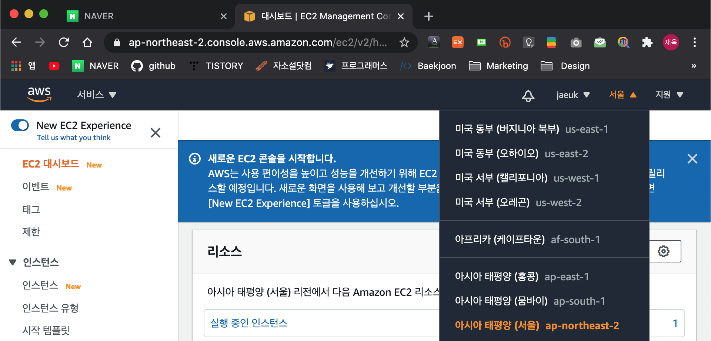
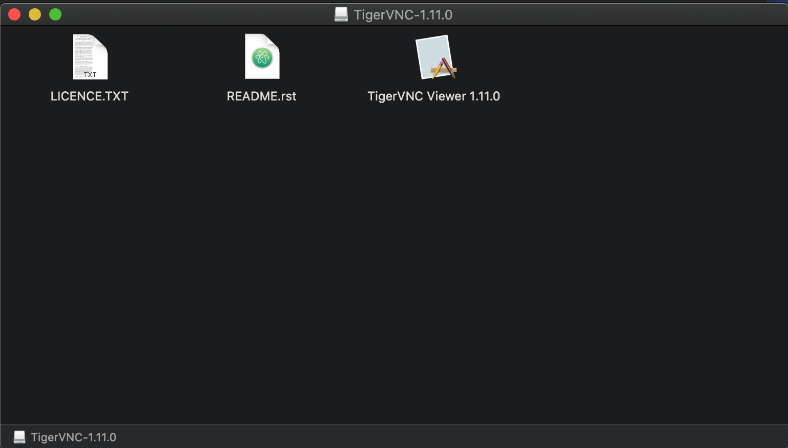
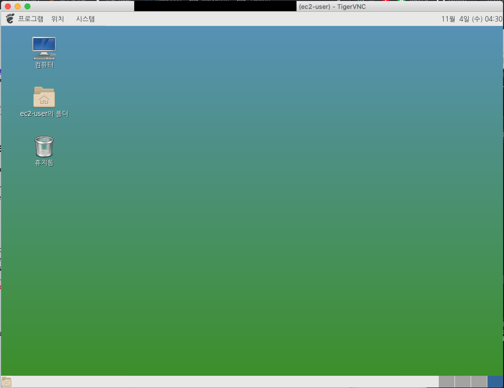
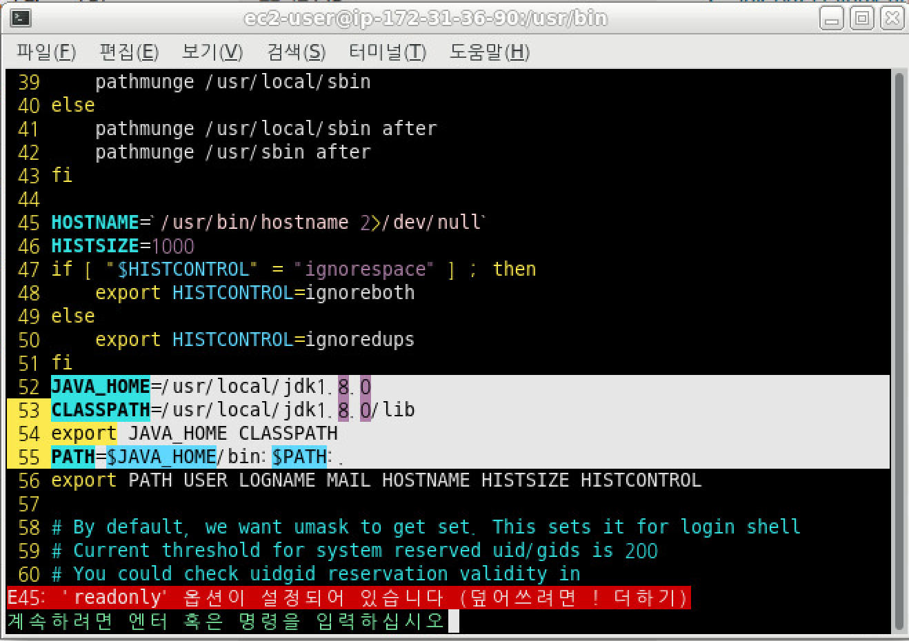
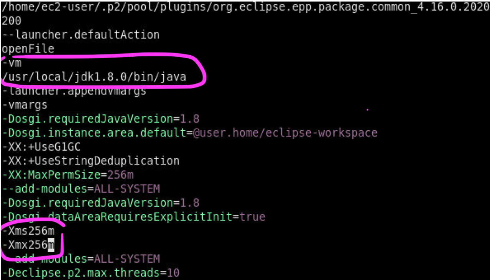

# AWS EC2 Linux 환경 구축

## 1. AWS 계정 생성 및 콘솔 로그인

[https://aws.amazon.com/ko/free/](https://aws.amazon.com/ko/free/?all-free-tier.sort-by=item.additionalFields.SortRank&all-free-tier.sort-order=asc)

</br></br>

## 2. 지역 서울로 변경



</br></br>

## 3. EC2 인스턴스 생성 & Linux 2 설치

https://docs.aws.amazon.com/ko_kr/AWSEC2/latest/UserGuide/EC2_GetStarted.html

* 다운 받은 keypair 파일(*.pem)은 일반적으로 root/.ssh 디렉토리에 보관한다.
* EC2를 설치하고 나면 CLI(Command Line Interface)를 설치해 이용이 가능하다.
  https://makemethink.tistory.com/181

</br></br>

## 4. GUI 설치 및 접속

https://aws.amazon.com/ko/premiumsupport/knowledge-center/ec2-linux-2-install-gui/

이 과정에서 로컬 컴퓨터에서 TigerVNC를 설치하고, VNC 클라이언트를 실행하는 과정에서 약간 버벅였다.

TigerVNC를 설치할 때는, 로컬 컴퓨터에 알맞는 확장자 dmg(Mac OS)로 다운로드 한다. 이후 설치 과정에서 생성되는 Viewer 파일을 응용프로그램 디렉토리로 복사해야 실행할 수 있다.

</br>




terminal에서 ssh로 EC2에 접속한 뒤, VNC Server 서비스를 띄워놓은 상태에서 로컬컴퓨터의 TigerVNC viewer를 실행시켜 localhost:1를 입력하면 EC2를 GUI로 이용할 수 있다.

* 크로니움, 한글 폰트 설치
  https://aws-diary.tistory.com/130

* GUI 설치 완료 결과



</br></br>

## 5. JDK 및 Eclipse 설치

> 이 과정부터는 이전 VMware나 VirtualBox에서 환경 구축과정과 동일.

</br>

AWS EC2에서 주의해야 할 부분은 '권한'이다. cp 명령어나 vim으로 /etc/profile 수정하려 하면 readonly에러가 발생하는 등 정상적으로 돌아가지 않는 경우가 있다. 



이런 상황에서는 `sudo` 명령어를 사용해 vim을 열어주거나, 명령어를 실행해주어야 한다.

</br></br>

Eclipse 설치 후에는  java 디렉토리와 메모리 환경설정을 변경해주어야 한다.

* vi /home/ec2-user/eclipse/java-2020-06/eclipse/eclipse.ini

```bash
-vm 

(jdk 경로)

 .
 .
 .

-Xms256m
-Xmx256m
```

</br>

