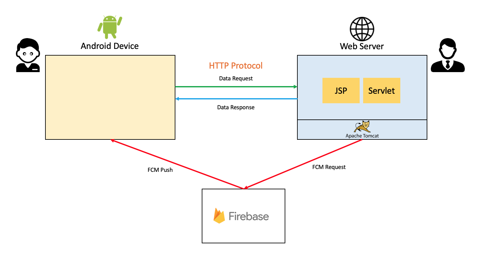
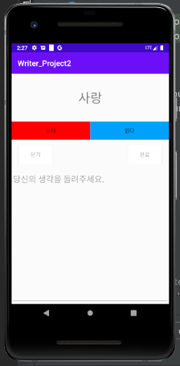
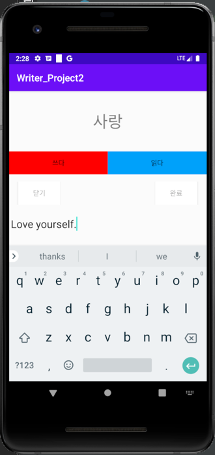
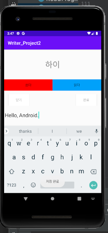
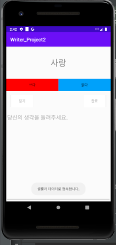

## 1. 기획 내용

안드로이드 개발에 있어 다양한 컴포넌트 및 위젯을 이해하고 활용하는 것을 목표로 유저가 **<u>글을 쓰고, 이를 공유할 수 있는 애플리케이션</u>**을 개발한다. <br><br>

## 2. 시스템 구성도



<br><br>

## 3. 구현 기술

Java 8, Android Studio 4.0.2, Apache Tomcat 9, Eclipse, JSP, FCM

<br><br>

## 4. 구현 내용

**1) 로그인 기능(서버 송수신)**

유저가 입력하는 ID, Password 을 서버로 전송하고, 서버에서 로그인 성공, 실패 결과를 받아온다. 서버로의 데이터 송수신 과정에서는 ProgressDialog를 띄워준다. 서버에서 수신한 로그인 결과가 성공이면 화면을 전환시키고, 로그인 결과가 실패이면 AlertDialog로 결과를 유저에게 알려준다.

<br>

**2) 글 쓰기 기능(서버 송수신)**

서버에서 제시어 데이터를 랜덤으로 받아와 화면에 띄워주고, 글을 작성할 수 있도록 한다. 유저가 글을 작성하고 완료 버튼을 클릭하면 저장 여부를 묻는 AlertDialog를 띄워주어 유저가 다시 한 번 확인할 수 있도록 한다. 유저가 저장 버튼을 누르면 서버로 작성한 데이터를 보내준다. (화면에서 읽다 버튼을 클릭하면 글쓰기 화면은 사라지고, 제시어에 연관된 유저들이 작성한 글을 뿌려준다. – 추후 데이터베이스 연동 학습 후 구현)

<br>

**3) FCM 푸시 수신 기능**

애플리케이션 관리자가 FCM을 통해 보내는 푸시 알람을 수신하고, Notification에 이미지와 함께 제목과 내용을 추가한다.

<br>

**4) 데이터 연결 상태 알림 Toast 기능**

유저의 데이터 연결 상태가 셀룰러 데이터 접속 상태인지, Wifi 접속 상태인지, 접속이 끊겨 있는 상태인지를 구분하고, Toast로 연결 상태에 대한 메시지를 띄워준다.

<br><br>

## 5. 구현 결과

### 1) 로그인 기능


**로그인 화면**

<br><br>


**로그인 로딩 ProgressDialog**

<br><br>


**로그인 실패 AlertDialog**

<br><br><br>


### 2) 글쓰기 기능



**제시어 표시 및 글쓰기 탭 화면**

<br><br>




**글 작성 화면**

<br><br>


**글 저장 확인 AlertDialog**

<br><br>




**글 저장 확인 Toast**

<br><br>


```jsp
<%@ page language="java" contentType="text/html; charset=UTF-8"
    pageEncoding="UTF-8"%>
<%@ page import="java.util.Random" %>
<%

String[] titles = {"우정", "친구", "사랑", "하이", "아까워하다"};
Random r = new Random();
int index = r.nextInt(titles.length);
System.out.println(titles[index]);
out.print(titles[index]);
%>
```

**제시어를 랜덤으로 전송하는 서버의 title.jsp**

<br><br>

****

**글읽기 탭 화면(데이터베이스 연동 학습 후 구현)**

<br><br><br>

### 3) FCM 푸시 수신 기능


****

**FCM 푸시 수신 화면**

<br>

<br>

```java
package ftest;

import java.io.IOException;
import java.io.OutputStreamWriter;
import java.net.HttpURLConnection;
import java.net.MalformedURLException;
import java.net.URL;

import javax.servlet.ServletException;
import javax.servlet.annotation.WebServlet;
import javax.servlet.http.HttpServlet;
import javax.servlet.http.HttpServletRequest;
import javax.servlet.http.HttpServletResponse;

import org.json.simple.JSONObject;

/**
 * Servlet implementation class FTest
 */
@WebServlet("/FTest")
public class FTest extends HttpServlet {
	private static final long serialVersionUID = 1L;
       
    /**
     * @see HttpServlet#HttpServlet()
     */
    public FTest() {
        super();
        // TODO Auto-generated constructor stub
    }

	@Override
	protected void service(HttpServletRequest request, HttpServletResponse response) throws ServletException, IOException {
		// 
		URL url = null;
		try {
			url = new URL("https://fcm.googleapis.com/fcm/send");
		} catch (MalformedURLException e) {
			System.out.println("Error while creating Firebase URL | MalformedURLException");
			e.printStackTrace();
		}
		HttpURLConnection conn = null;
		try {
			conn = (HttpURLConnection) url.openConnection();
		} catch (IOException e) {
			System.out.println("Error while createing connection with Firebase URL | IOException");
			e.printStackTrace();
		}
		conn.setUseCaches(false);
		conn.setDoInput(true);
		conn.setDoOutput(true);
		conn.setRequestProperty("Content-Type", "application/json");

		// set my firebase server key
		conn.setRequestProperty("Authorization", "key="
				+ "개인 Key");

		// create notification message into JSON format
		
		JSONObject message = new JSONObject();
		message.put("to", "/topics/writer");
		message.put("priority", "high");
		
		JSONObject notification = new JSONObject();
		notification.put("title", "title1");
		notification.put("body", "body1");
		message.put("notification", notification);
		
		JSONObject data = new JSONObject();
		data.put("data", 100);
		message.put("data", data);


		try {
			OutputStreamWriter out = new OutputStreamWriter(conn.getOutputStream(), "UTF-8");
			out.write(message.toString());
			out.flush();
			conn.getInputStream();
			System.out.println("OK...............");

		} catch (IOException e) {
			System.out.println("Error while writing outputstream to firebase sending to ManageApp | IOException");
			e.printStackTrace();
		}	
	}
}

```


**FCM 푸시 송신 서버 Servlet(FTest.java)**

<br><br><br>

### 4) 데이터 연결 상태 알림 기능



**데이터 연결 상태 알림 Toast 화면(셀룰러)**

<br><br>


**데이터 연결 상태 알림 Toast 화면(Wifi)**

