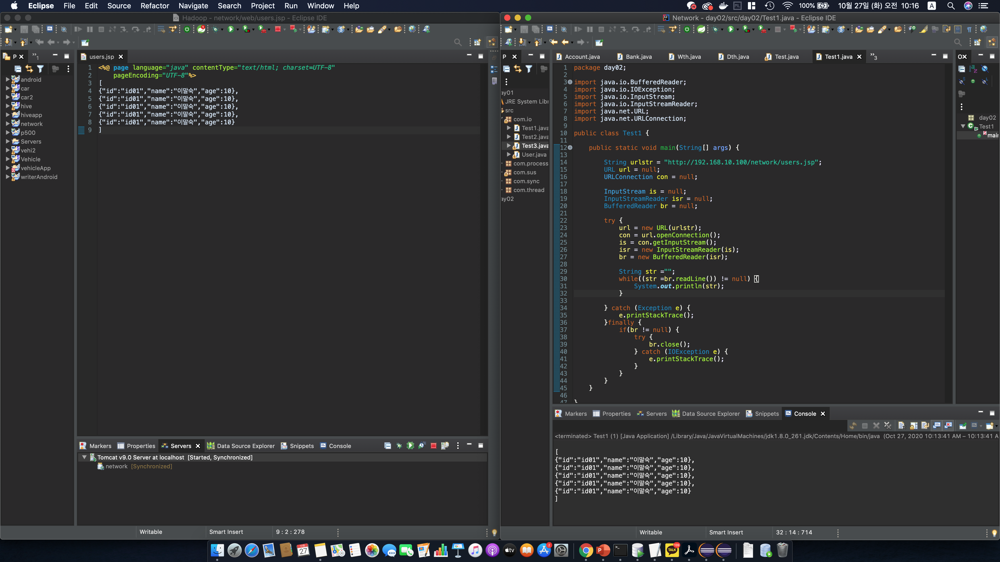
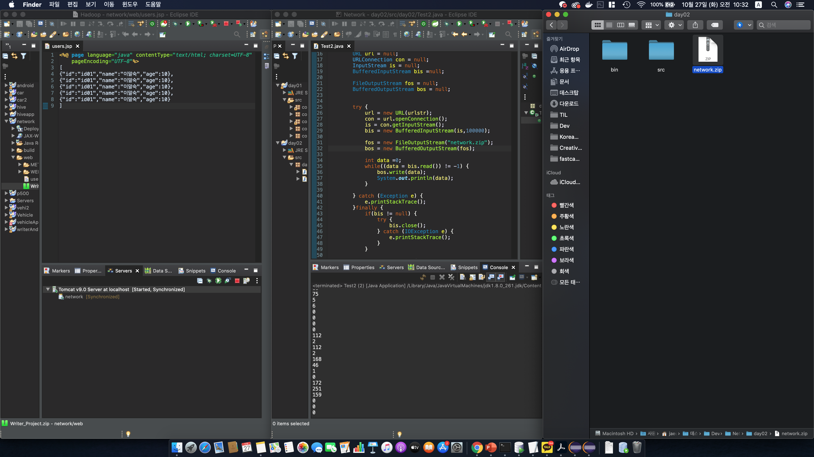
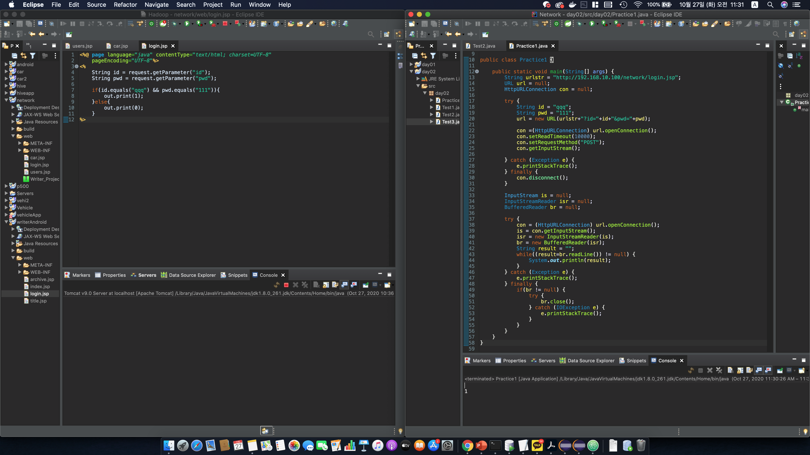
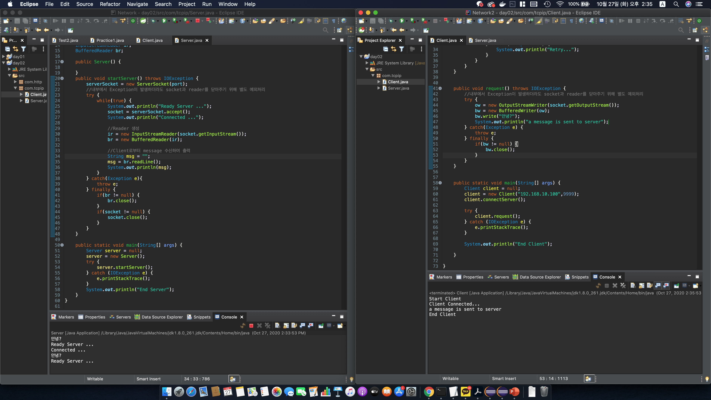

# 네트워크 통신 실습(Http, TCP/IP)

일시: 2020년 10월 27일

## 1. HTTP 네트워크 구현 실습

### 1.1. Server로부터 메시지 수신

> com.http 패키지 내 Test1.java

### 1.2. Server와 파일 수신

> com.http 패키지 내 Test1.java

### 1.3. Server로 메시지 송신

> com.http 패키지 내 Test1.java

### 1.4. Server와 메시지 송수신

> com.http 패키지 내 Practice1.java

## 2. TCP/IP 네트워크 구현 실습

>  본 프로젝트 디렉토리의 com.tcpip 패키지 내 Server.java와  
>
> [여기]()의 com.tcpip 패키지 내 Client.java

