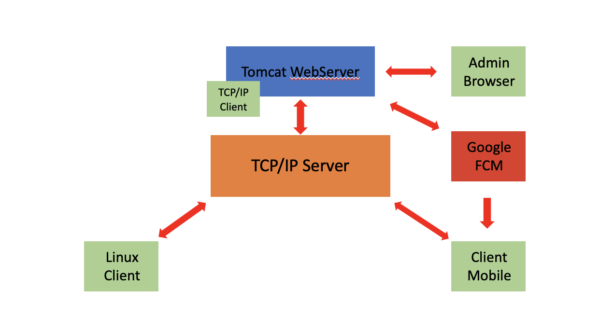
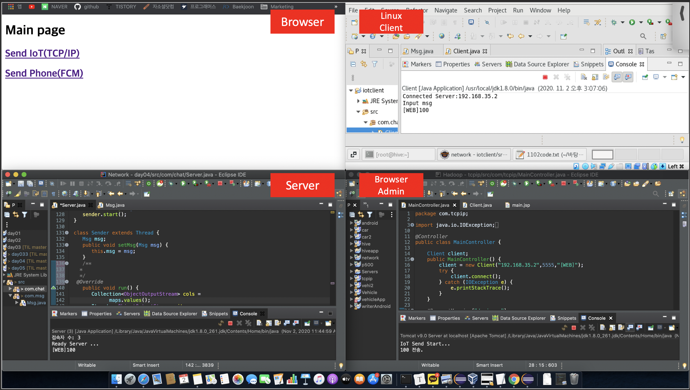
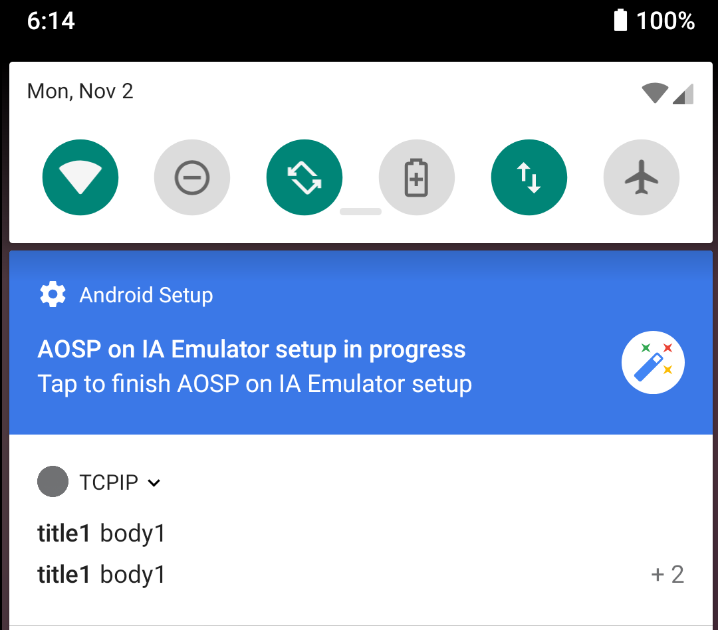

# 클라이언트간 TCP/IP 통신 네트워크 프로그래밍 실습(Web)

일시: 2020년 11월 2일

* 시스템 구성도



관리자 유저가 Browser를 통해 Client와 통신을 주고받는 시나리오를 가정한다. Server가 중간에서 관리자 유저와 Client의 메시지를 받아 데이터를 송신해준다. 이 시스템은 추후 Client의 센서로 데이터를 전달받아 Server에서 DB나 Log를 생성하고, 관리자가 이를 활용해 Client의 IoT 액츄에이터를 제어하거나 모바일로 데이터를 송신해주는 큰 시스템으로 확장될 수 있다.</br>

여기서는 관리자가 브라우저를 통해 Client로 데이터를 송신하고, Client는 이를 수신하는 시스템을 구현하였다. Client는 하나의 노트북에서 실습을 위해 VirtualBox로 리눅스 환경을 구축하고, Android Studio에서 세팅했다.

## 구현 결과

* 메시지 송수신



Host(Browser Admin. Server) IP:  192.168.35.2

VirtualBox Linux(Linux Client) IP:  192.168.35.62

Browser Admin에서 Linux Client로 데이터(100) 전송

* FCM



## 1. Server

### Msg.java

```java
package com.msg;

import java.io.Serializable;
import java.util.ArrayList;
import java.util.HashMap;
import java.util.Map;

public class Msg implements Serializable{
   /**
    * 
    */
   private static final long serialVersionUID = 1L;
   private HashMap<String, Msg> maps;
   private ArrayList<String> ips;
   private String id;
   private String msg;

   
   
   
   public Msg(HashMap<String, Msg> maps, ArrayList<String> ips, String id, String msg) {
	this.maps = maps;
	this.ips = ips;
	this.id = id;
	this.msg = msg;
	}
	public Msg(ArrayList<String> ips, String id, String msg) {
		this.ips = ips;
		this.id = id;
		this.msg = msg;
	}
	public Msg(String id, String msg) {
		this.id = id;
		this.msg = msg;
	}
	public Msg() {
	}
	public HashMap<String, Msg> getMaps() {
		return maps;
	}
	public void setMaps(HashMap<String, Msg> maps) {
		this.maps = maps;
	}
   public ArrayList<String> getIps() {
		return ips;
	}
	public void setIps(ArrayList<String> ips) {
		this.ips = ips;
	}
	public String getId() {
      return id;
   }
   public void setId(String id) {
      this.id = id;
   }
   public String getMsg() {
      return msg;
   }
   public void setMsg(String msg) {
      this.msg = msg;
   }
}
```

</br>

### Server.java

```java
package com.chat;

import java.io.IOException;
import java.io.ObjectInputStream;
import java.io.ObjectOutputStream;
import java.net.InetAddress;
import java.net.ServerSocket;
import java.net.Socket;
import java.util.ArrayList;
import java.util.Collection;
import java.util.HashMap;
import java.util.Iterator;
import java.util.Set;

import com.msg.Msg;

public class Server {

   int port;

   HashMap<String, ObjectOutputStream> maps;

   ServerSocket serverSocket;

//   Receiver receiver;
   

   public Server() {
   }

   public Server(int port) {
      this.port = port;
      maps = new HashMap<>();
   }

   public void startServer() throws Exception {
      serverSocket = new ServerSocket(port);
      System.out.println("Start Server...");

      Runnable r = new Runnable() { // 받으면서 다른 것도 할 수 있도록 Thread 사용

         @Override
         public void run() {
            while (true) {
               try {
                  Socket socket = null;
                  System.out.println("Ready Server ...");
                  socket = serverSocket.accept();
                  System.out.println(socket.getInetAddress());
                  makeOut(socket);
                  new Receiver(socket).start();
               } catch (Exception e) {
            	   //Android Studio Error(Invalid Stream header)
                  //e.printStackTrace();
               }
            } // end while
         }
      };
      new Thread(r).start();

   }

   public void makeOut(Socket socket) throws IOException {
      ObjectOutputStream oo;
      oo = new ObjectOutputStream(socket.getOutputStream());
      maps.put(socket.getInetAddress().toString(), oo);
      System.out.println("접속자 수: " + maps.size());
   }

   class Receiver extends Thread {
      Socket socket;
      ObjectInputStream oi;

      public Receiver(Socket socket) throws IOException {
         this.socket = socket;
         oi = new ObjectInputStream(this.socket.getInputStream());
      }

      @Override
      public void run() {
         while (oi != null) {
            Msg msg = null;
            try {
               msg = (Msg) oi.readObject();
               System.out.println(msg.getId()+msg.getMsg());
               
               if (msg.getMsg().equals("q")) {
                  throw new Exception();
               } else if(msg.getMsg().equals("1")) {
                  String ip = socket.getInetAddress().toString();
                  ArrayList<String> ips = new ArrayList<>();
                  ips.add(ip); // 1을 쓴 본인에게 ips를 보낸다
                  //msg.setIps(ips); // ips를 msg에 넣는다
                  Set<String> keys = maps.keySet(); //사용자들의 정보를 가져온다
                  HashMap<String, Msg> hm = new HashMap<>();
                  for(String k:keys) {
                     hm.put(k, null);
                  } 
                  //1을 보낸 client , 서버의 접속자 ip들
                  msg.setMaps(hm);
               }
               sendMsg(msg);
            } catch (Exception e) {
               maps.remove(socket.getInetAddress().toString());
               System.out.println(socket.getInetAddress() + "..Exited");
               System.out.println("접속자수: " + maps.size());
               break;
            }   
         } // end while

         try {
            if(oi != null) {
               oi.close();
            }
            if (socket != null) {
               socket.close();
            }
         } catch (Exception e) {

         }

      }
   }

   public void sendMsg(Msg msg) {
      Sender sender = new Sender();
      sender.setMsg(msg);
      sender.start();
   }
   
   class Sender extends Thread {
      Msg msg;
      public void setMsg(Msg msg) {
         this.msg = msg;
      }
      /**
     *
     */
    @Override
      public void run() {
         Collection<ObjectOutputStream> cols =
               maps.values();
         Iterator<ObjectOutputStream> it = 
               cols.iterator();
         while(it.hasNext()) {
            try {
            if(msg.getIps() != null ) {
               for(String ip:msg.getIps()) {
                  maps.get(ip).writeObject(msg);
               }
               break; // break로 while을 끝내서 it.next().writeObject(msg); 가 작동되지 않도록 한다
               // broadcast하지 말라고 break;를 거는 것
            }
               it.next().writeObject(msg);
            } catch (IOException e) {
               e.printStackTrace();
            }
         }
      }
      
   }

   public static void main(String[] args){
      Server server = new Server(5555);
      try {
         server.startServer();
      } catch (Exception e) {
         e.printStackTrace();
      }
   }
}
```


## 2. Browser Admin

> 1. Eclipse 별도 workspace에 Dynamic Web Project 생성
> 2. Project Configure - convert to maven project
> 3. Project Spring - Add Spring Project Nature
> 4. web.xml에 Spring Dispatcher 내용 추가
> 5. WEB-INF내 config 폴더 생성
> 6. 5번 디렉토리 내 Spring Bean Configuration File(spring.xml) 생성
> 7. spring.xml에 ViewResolver 내용 추가

</br>

* web.xml

```xml
<?xml version="1.0" encoding="UTF-8"?>
<web-app xmlns:xsi="http://www.w3.org/2001/XMLSchema-instance" xmlns="http://xmlns.jcp.org/xml/ns/javaee" xsi:schemaLocation="http://xmlns.jcp.org/xml/ns/javaee http://xmlns.jcp.org/xml/ns/javaee/web-app_4_0.xsd" id="WebApp_ID" version="4.0">
  <display-name>tcpip</display-name>
  <welcome-file-list>
    <welcome-file>index.html</welcome-file>
    <welcome-file>index.htm</welcome-file>
    <welcome-file>index.jsp</welcome-file>
    <welcome-file>default.html</welcome-file>
    <welcome-file>default.htm</welcome-file>
    <welcome-file>default.jsp</welcome-file>
  </welcome-file-list>
  
	<!-- Spring Dispatcher -->
	<servlet>
		<servlet-name>action</servlet-name>
		<servlet-class>org.springframework.web.servlet.DispatcherServlet</servlet-class>
		<init-param>
			<param-name>contextConfigLocation</param-name>
			<param-value>/WEB-INF/config/spring.xml</param-value>
		</init-param>
	</servlet>
	<servlet-mapping>
		<servlet-name>action</servlet-name>
		<url-pattern>*.mc</url-pattern>
	</servlet-mapping>

	<!-- Encoding Filter -->
	<filter>
		<filter-name>enc</filter-name>
		<filter-class>org.springframework.web.filter.CharacterEncodingFilter</filter-class>
		<init-param>
			<param-name>encoding</param-name>
			<param-value>UTF-8</param-value>
		</init-param>
	</filter>

	<filter-mapping>
		<filter-name>enc</filter-name>
		<url-pattern>/*</url-pattern>
	</filter-mapping>
	
</web-app>
```

</br>

* spring.xml

```xml
<?xml version="1.0" encoding="UTF-8"?>
<beans xmlns="http://www.springframework.org/schema/beans"
	xmlns:xsi="http://www.w3.org/2001/XMLSchema-instance"
	xmlns:aop="http://www.springframework.org/schema/aop"
	xmlns:context="http://www.springframework.org/schema/context"
	xmlns:p="http://www.springframework.org/schema/p"
	xmlns:tx="http://www.springframework.org/schema/tx"
	xmlns:mvc="http://www.springframework.org/schema/mvc"
	xsi:schemaLocation="http://www.springframework.org/schema/mvc http://www.springframework.org/schema/mvc/spring-mvc-4.2.xsd
		http://www.springframework.org/schema/beans http://www.springframework.org/schema/beans/spring-beans.xsd
		http://www.springframework.org/schema/context http://www.springframework.org/schema/context/spring-context-4.2.xsd
		http://www.springframework.org/schema/aop http://www.springframework.org/schema/aop/spring-aop-4.2.xsd
		http://www.springframework.org/schema/tx http://www.springframework.org/schema/tx/spring-tx-4.2.xsd">
	<context:component-scan base-package="com.*" />
	<aop:aspectj-autoproxy></aop:aspectj-autoproxy>
	
	<mvc:annotation-driven />
	<tx:annotation-driven transaction-manager="txManager" />


	<!-- ViewResolver -->
	<bean id="viewResolver"
		class="org.springframework.web.servlet.view.InternalResourceViewResolver">
		<property name="prefix" value="/view/" />
		<property name="suffix" value=".jsp" />
		<property name="order" value="0" />
	</bean>
	<!-- File Upload -->
	<bean id="multipartResolver"
		class="org.springframework.web.multipart.commons.CommonsMultipartResolver">
		<property name="maxUploadSize" value="500000000" />
	</bean>

	<!-- Multi language -->

	<bean id="messageSource"
		class="org.springframework.context.support.ResourceBundleMessageSource">
		<property name="basenames">
			<list>
				<value>messages/messages</value>
			</list>
		</property>
	</bean>
	<bean id="localeResolver"
		class="org.springframework.web.servlet.i18n.SessionLocaleResolver">
	</bean>
	<mvc:interceptors>
		<bean
			class="org.springframework.web.servlet.i18n.LocaleChangeInterceptor">
			<property name="paramName" value="lang" />
		</bean>
	</mvc:interceptors>
	
</beans>
```

> 두 xml 안에는 꼭 필요하지 않은 내용도 추가로 들어있다.

</br></br>

### web/index.html

```html
<script>
location.href='main.mc';
</script>
```

</br>

### web/view/main.jsp

```jsp
<%@ page language="java" contentType="text/html; charset=UTF-8"
    pageEncoding="UTF-8"%>
    <%@ taglib prefix="c" uri="http://java.sun.com/jsp/jstl/core"%>
<!DOCTYPE html>
<html>
<head>
<meta charset="UTF-8">
<title>Insert title here</title>
<script src="https://ajax.googleapis.com/ajax/libs/jquery/1.11.3/jquery.min.js"></script>
<script>

$(document).ready(function(){
	$('#iot').click(function(){
		$.ajax({
			url:'iot.mc',
			success:function(data){
				alert('Send IoT Complete...');
			}
		});
	});
	$('#phone').click(function(){
		$.ajax({
			url:'phone.mc',
			success:function(data){
				alert('Send Phone Complete...');
			}
		});
	});
});
</script>
</head>
<body>
<h1>Main page</h1>
<h2><a id="iot" href="#">Send IoT(TCP/IP)</a></h2>
<h2><a id="phone" href="#">Send Phone(FCM)</a></h2>
</body>
</html>
```


</br>

### src/com.msg/Msg.java

```java
package com.msg;

import java.io.Serializable;
import java.util.ArrayList;
import java.util.HashMap;
import java.util.Map;

public class Msg implements Serializable{
   /**
    * 
    */
   private static final long serialVersionUID = 1L;
   private HashMap<String, Msg> maps;
   private ArrayList<String> ips;
   private String id;
   private String msg;

   
   
   
   public Msg(HashMap<String, Msg> maps, ArrayList<String> ips, String id, String msg) {
	this.maps = maps;
	this.ips = ips;
	this.id = id;
	this.msg = msg;
	}
	public Msg(ArrayList<String> ips, String id, String msg) {
		this.ips = ips;
		this.id = id;
		this.msg = msg;
	}
	public Msg(String id, String msg) {
		this.id = id;
		this.msg = msg;
	}
	public Msg() {
	}
	public HashMap<String, Msg> getMaps() {
		return maps;
	}
	public void setMaps(HashMap<String, Msg> maps) {
		this.maps = maps;
	}
	

   public ArrayList<String> getIps() {
		return ips;
	}
	public void setIps(ArrayList<String> ips) {
		this.ips = ips;
	}
	public String getId() {
      return id;
   }
   public void setId(String id) {
      this.id = id;
   }
   public String getMsg() {
      return msg;
   }
   public void setMsg(String msg) {
      this.msg = msg;
   }
}
```

</br>

### src/com.chat/Client.java

```java
package com.chat;

import java.io.IOException;
import java.io.ObjectInputStream;
import java.io.ObjectOutputStream;
import java.net.Socket;
import java.util.ArrayList;
import java.util.HashMap;
import java.util.Map;
import java.util.Scanner;
import java.util.Set;

import com.msg.Msg;

public class Client {

	int port;
	String address;
	String id;
	Socket socket;
	Sender sender;

	public Client() {}
	public Client(String address, int port, String id) {
		this.address = address;
		this.port = port;
		this.id = id;
		
	}
	
	public void connect() throws IOException {
		try {
			socket = new Socket(address, port);
		} catch (Exception e) {
			while(true) {
				try {
					Thread.sleep(2000);
					socket = new Socket(address, port);
					break;
				}catch(Exception e1) {
					System.out.println("Retry...");
				}
			}
		} 
		
		System.out.println("Connected Server:"+address);
		sender = new Sender(socket);
		// new Receiver(socket).start();
	}

	public void sendTarget(String ip, String cmd) {
		ArrayList<String> ips = new ArrayList<String>();
		ips.add(ip);
		Msg msg = new Msg(ips, id, cmd);
		sender.setMsg(msg);
		System.out.println(msg.getMsg()+" 전송.");
		new Thread(sender).start();
	}
	
	public void sendMsg() {
		Scanner sc = new Scanner(System.in);
		while(true) {
			System.out.println("Input msg");
			String ms = sc.nextLine();
			
			// 1을 보내면 서버에서는 사용자 리스트를 보낸다.
			Msg msg = null;
			if(ms.equals("1")) {
				msg = new Msg(id,ms);
			}else {
				ArrayList<String> ips = new ArrayList<>();
				ips.add("/192.168.35.2");
				///////////////////////////////주
				msg = new Msg(ips,id,ms);
			}
			sender.setMsg(msg);
			new Thread(sender).start();
			if(ms.equals("q")) {
				break;
			}
		}
		sc.close();
		if(socket != null) {
			try {
				socket.close();
			} catch (IOException e) {
				e.printStackTrace();
			}
		}
		System.out.println("Bye....");
	}
	
	class Sender implements Runnable{
		Socket socket;
		ObjectOutputStream oo;
		Msg msg;
		public Sender(Socket socket) throws IOException {
			this.socket = socket;
			oo = new ObjectOutputStream(socket.getOutputStream());
		}
		public void setMsg(Msg msg) {
			this.msg = msg;
		}
		@Override
		public void run() {
			if(oo != null) {
				try {
					oo.writeObject(msg);
				} catch (IOException e) {
					//e.printStackTrace();
					try{
						if(socket != null) {
							socket.close();
						}
						
					}catch(Exception e1) {
						e1.printStackTrace();
					}
					
					try {
						Thread.sleep(2000);
						connect();
					} catch (Exception e1) {
						e1.printStackTrace();
					}
				}
			}
		}
		
	}
	
	class Receiver extends Thread{
		ObjectInputStream oi;
		public Receiver(Socket socket) throws IOException {
			oi = new ObjectInputStream(socket.getInputStream());
		}
		@Override
		public void run() {
			while(oi != null) {
				Msg msg = null;
				try {
					msg = (Msg) oi.readObject();
					if(msg.getMaps() != null) {
						HashMap<String, Msg> hm = (HashMap<String, Msg>) msg.getMaps();
						Set<String> keys = hm.keySet();
						for(String key: keys) {
							System.out.println(key);
						}
						continue;
					}
					System.out.println(msg.getId()+msg.getMsg());
				} catch (Exception e) {
					e.printStackTrace();
					break;
				} 
			} // end while
			try {
				if(oi != null) {
					oi.close();
				}
				if(socket != null) {
					socket.close();
				}
			}catch(Exception e) {
				
			}
			
		}
		
	}
	
	public static void main(String[] args) {
		Client client = new Client("192.168.35.2",5555,
				"[Jaeuk]");
		try {
			client.connect();
			client.sendMsg();
		} catch (IOException e) {
			e.printStackTrace();
		}
	}

}
```

</br>

### src/com.tcpip/MainController.java

```java
package com.tcpip;

import java.io.IOException;
import java.io.OutputStreamWriter;
import java.net.HttpURLConnection;
import java.net.MalformedURLException;
import java.net.URL;

import org.json.simple.JSONObject;
import org.springframework.stereotype.Controller;
import org.springframework.web.bind.annotation.RequestMapping;
import org.springframework.web.servlet.ModelAndView;

import com.chat.Client;

@Controller
public class MainController {
	
	Client client;
	public MainController() {
		client = new Client("192.168.35.2",5555,"[WEB]");
		try {
			client.connect();
		} catch (IOException e) {
			e.printStackTrace();
		}
	}
	
	@RequestMapping("/main.mc")
	public ModelAndView main() {
		ModelAndView mv = new ModelAndView();
		mv.setViewName("main");
		return mv;
	}
	@RequestMapping("/iot.mc")
	public void iot() {
		System.out.println("IoT Send Start...");
		client.sendTarget("/192.168.35.62", "100");
	}
	@RequestMapping("/phone.mc")
	public void phone() {
		System.out.println("phone Send Start...");
		
		URL url = null;
		try {
			url = new URL("https://fcm.googleapis.com/fcm/send");
		} catch (MalformedURLException e) {
			System.out.println("Error while creating Firebase URL | MalformedURLException");
			e.printStackTrace();
		}
		HttpURLConnection conn = null;
		try {
			conn = (HttpURLConnection) url.openConnection();
		} catch (IOException e) {
			System.out.println("Error while createing connection with Firebase URL | IOException");
			e.printStackTrace();
		}
		conn.setUseCaches(false);
		conn.setDoInput(true);
		conn.setDoOutput(true);
		conn.setRequestProperty("Content-Type", "application/json");

		// set my firebase server key
		conn.setRequestProperty("Authorization", "key="
				+ "AAAArEyZKFc:APA91bFbensIi5nImV_Hsz4JRvHGwDCHPLjEgWc6th59MxVvgG--1OrFQLzaYcJnRZJK5Z2qp0vKuE-CsXR7rDHRtrTEyLvqdwAEzN8WmGOukUf1dsobAcQmBT2Sx_MigKhIRXBwC2b7");

		// create notification message into JSON format
		
		JSONObject message = new JSONObject();
		message.put("to", "/topics/tcpip");
		message.put("priority", "high");
		
		JSONObject notification = new JSONObject();
		notification.put("title", "title1");
		notification.put("body", "body1");
		message.put("notification", notification);
		
		JSONObject data = new JSONObject();
		data.put("control", "control1");
		data.put("data", 100);
		message.put("data", data);


		try {
			OutputStreamWriter out = new OutputStreamWriter(conn.getOutputStream(), "UTF-8");
			System.out.println("FCM 전송:"+message.toString());
			out.write(message.toString());
			out.flush();
			conn.getInputStream();
			System.out.println("OK...............");

		} catch (IOException e) {
			System.out.println("Error while writing outputstream to firebase sending to ManageApp | IOException");
			e.printStackTrace();
		}	
		
		System.out.println("phone Send End...");
	}
}


```

</br></br>

## 3. Linux Client

### src/com.chat/Client.java

```java
package com.chat;

import java.io.IOException;
import java.io.ObjectInputStream;
import java.io.ObjectOutputStream;
import java.net.Socket;
import java.util.ArrayList;
import java.util.HashMap;
import java.util.Map;
import java.util.Scanner;
import java.util.Set;

import com.msg.Msg;

public class Client {

	int port;
	String address;
	String id;
	Socket socket;
	Sender sender;

	public Client() {}
	public Client(String address, int port, String id) {
		this.address = address;
		this.port = port;
		this.id = id;
		
	}
	
	public void connect() throws IOException {
		try {
			socket = new Socket(address, port);
		} catch (Exception e) {
			while(true) {
				try {
					Thread.sleep(2000);
					socket = new Socket(address, port);
					break;
				}catch(Exception e1) {
					System.out.println("Retry...");
				}
			}
		} 
		
		System.out.println("Connected Server:"+address);
		sender = new Sender(socket);
		new Receiver(socket).start();
	}
	
	public void sendMsg() {
		Scanner sc = new Scanner(System.in);
		while(true) {
			System.out.println("Input msg");
			String ms = sc.nextLine();
			
			// 1을 보내면 서버에서는 사용자 리스트를 보낸다.
			Msg msg = null;
			if(ms.equals("1")) {
				msg = new Msg(id,ms);
			}else {
				ArrayList<String> ips = new ArrayList<>();
				ips.add("/192.168.0.9");
				ips.add("/192.168.0.72");
				ips.add("/192.168.0.28");
				///////////////////////////////주
				msg = new Msg(null,id,ms);
			}
			sender.setMsg(msg);
			new Thread(sender).start();
			if(ms.equals("q")) {
				break;
			}
		}
		sc.close();
		if(socket != null) {
			try {
				socket.close();
			} catch (IOException e) {
				e.printStackTrace();
			}
		}
		System.out.println("Bye....");
	}
	
	class Sender implements Runnable{
		Socket socket;
		ObjectOutputStream oo;
		Msg msg;
		public Sender(Socket socket) throws IOException {
			this.socket = socket;
			oo = new ObjectOutputStream(socket.getOutputStream());
		}
		public void setMsg(Msg msg) {
			this.msg = msg;
		}
		@Override
		public void run() {
			if(oo != null) {
				try {
					oo.writeObject(msg);
				} catch (IOException e) {
					//e.printStackTrace();
					try{
						if(socket != null) {
							socket.close();
						}
						
					}catch(Exception e1) {
						e1.printStackTrace();
					}
					
					try {
						Thread.sleep(2000);
						connect();
					} catch (Exception e1) {
						e1.printStackTrace();
					}
				}
			}
		}
		
	}
	
	class Receiver extends Thread{
		ObjectInputStream oi;
		public Receiver(Socket socket) throws IOException {
			oi = new ObjectInputStream(socket.getInputStream());
		}
		@Override
		public void run() {
			while(oi != null) {
				Msg msg = null;
				try {
					msg = (Msg) oi.readObject();
					if(msg.getMaps() != null) {
						HashMap<String, Msg> hm = (HashMap<String, Msg>) msg.getMaps();
						Set<String> keys = hm.keySet();
						for(String key: keys) {
							System.out.println(key);
						}
						continue;
					}
					System.out.println(msg.getId()+msg.getMsg());
				} catch (Exception e) {
					e.printStackTrace();
					break;
				} 
			} // end while
			try {
				if(oi != null) {
					oi.close();
				}
				if(socket != null) {
					socket.close();
				}
			}catch(Exception e) {
				
			}
			
		}
		
	}
	
	public static void main(String[] args) {
		Client client = new Client("192.168.35.2",5555,
				"[Jaeuk]");
		try {
			client.connect();
			client.sendMsg();
		} catch (IOException e) {
			e.printStackTrace();
		}
	}


```


### src/com.msg/msg.java

```java
package com.msg;

import java.io.Serializable;
import java.util.ArrayList;
import java.util.HashMap;
import java.util.Map;

public class Msg implements Serializable{
   /**
    * 
    */
   private static final long serialVersionUID = 1L;
   private HashMap<String, Msg> maps;
   private ArrayList<String> ips;
   private String id;
   private String msg;

   
   
   
   public Msg(HashMap<String, Msg> maps, ArrayList<String> ips, String id, String msg) {
	this.maps = maps;
	this.ips = ips;
	this.id = id;
	this.msg = msg;
	}
	public Msg(ArrayList<String> ips, String id, String msg) {
		this.ips = ips;
		this.id = id;
		this.msg = msg;
	}
	public Msg(String id, String msg) {
		this.id = id;
		this.msg = msg;
	}
	public Msg() {
	}
	
	public HashMap<String, Msg> getMaps() {
		return maps;
	}
	public void setMaps(HashMap<String, Msg> maps) {
		this.maps = maps;
	}
	

   public ArrayList<String> getIps() {
		return ips;
	}
	public void setIps(ArrayList<String> ips) {
		this.ips = ips;
	}
	public String getId() {
      return id;
   }
   public void setId(String id) {
      this.id = id;
   }
   public String getMsg() {
      return msg;
   }
   public void setMsg(String msg) {
      this.msg = msg;
   }
}

```

## 4. Mobile Client

[여기](https://github.com/socialDe/TIL/tree/master/Learned_Contents/AndroidPractice/TCPIP)

